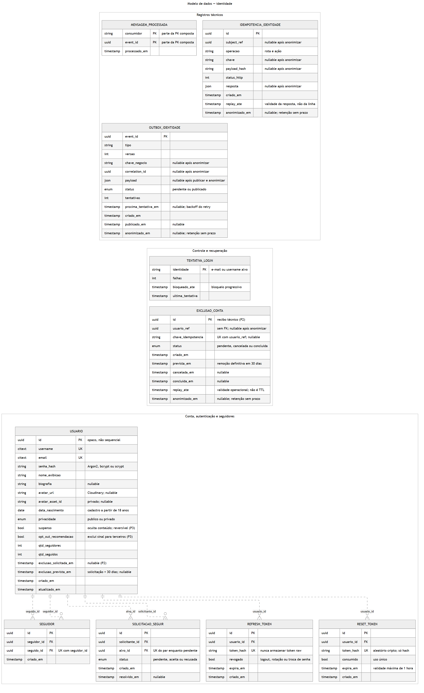
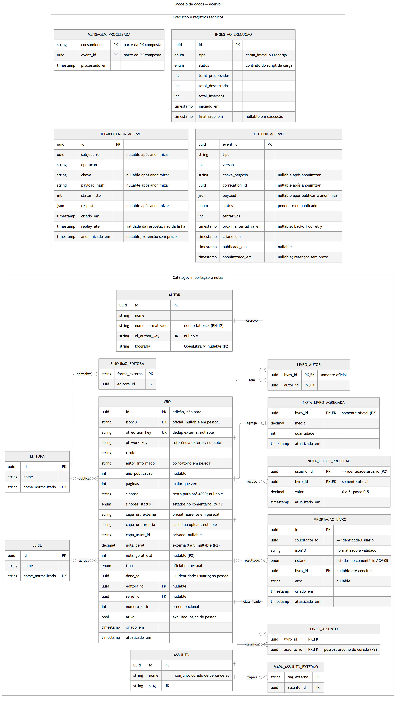
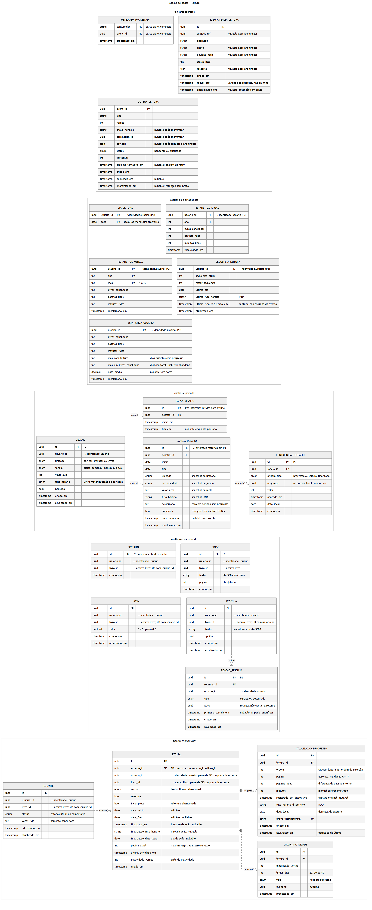
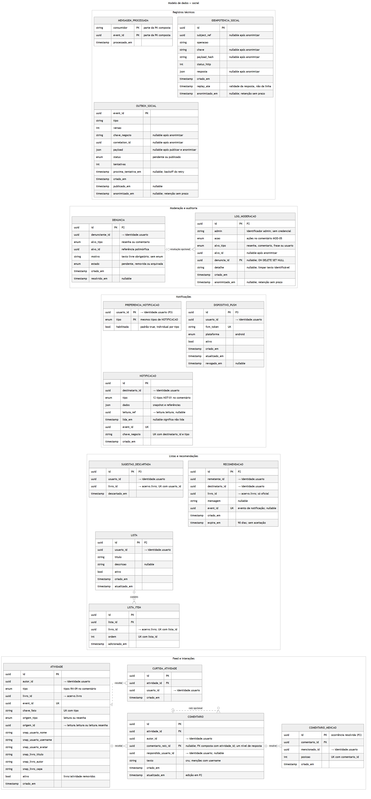

<!-- Documento DERIVADO do orquestador (docs/orquestador/documento-de-arquitetura.md §1, §3, §4
     e docs/orquestador/REQUISITOS.md §3, §5). Não editar isoladamente.
     Ver docs/orquestador/plano-de-projeto.md §2.1. -->

# 4. Modelagem e Projeto Arquitetural

A solução é um backend de **microsserviços** consumido por HTTP/JSON por dois clientes independentes — o app móvel em Flutter (produto principal) e a SPA web em Vue + Tailwind (subconjunto). São **quatro serviços** (`identidade`, `acervo`, `leitura`, `social`), um broker de mensageria (RabbitMQ) para os fluxos assíncronos, um PostgreSQL único no Neon com **um schema por serviço**, e um conjunto de serviços de apoio gratuitos (imagens, e-mail, push, agendador). A decomposição segue o ciclo de valor do produto — *encontrar livro → registrar leitura → acompanhar progresso → ver amigos* —, mantendo na mesma fronteira o que participa do mesmo caminho crítico.

> ⏳ **Figura pendente de renderização** — fonte em `docs/diagramas/visao-geral.mmd`.

**Figura 1 — Visão geral da solução (macroarquitetura). Fonte: o próprio autor.**

## 4.1. Histórias de Usuário

| EU COMO... `PERSONA` | QUERO/PRECISO ... `FUNCIONALIDADE` | PARA ... `MOTIVO/VALOR` |
|---|---|---|
| Leitor (Beatriz) | buscar um livro pelo título e adicioná-lo à minha estante como "Quero ler" | organizar o que pretendo ler em um só lugar |
| Leitor (Beatriz) | registrar meu progresso informando a página em que parei | acompanhar o quanto já avancei em cada livro |
| Leitor (Beatriz) | escrever uma resenha e dar uma nota a um livro | compartilhar minha opinião com quem me segue |
| Leitor (Rafael) | criar um desafio de "20 páginas por dia" | ter uma meta curta e concreta que me mantenha lendo |
| Leitor (Rafael) | ver minhas estatísticas de páginas e livros por mês | acompanhar minha evolução em números |
| Leitor (Rafael) | manter uma sequência diária de leitura (*streak*) | criar constância no hábito |
| Leitor (Marina) | definir meu perfil como privado e aceitar quem me segue | controlar quem vê minha atividade de leitura |
| Leitor (Marina) | ser encontrada apenas por username exato | preservar minha privacidade num público jovem |
| Leitor (Beatriz) | recomendar um livro a um amigo que também me segue | trocar indicações com quem tem meu gosto |
| Leitor (Beatriz) | ver um feed com o que meus amigos estão lendo e resenhando | sentir que leio acompanhada |
| Leitor (Rafael) | retomar uma leitura que abandonei, da página onde parei | não recomeçar do zero |
| Leitor (Cláudia) | registrar meu progresso mesmo quando estou sem internet | não perder o registro por causa de uma conexão instável |
| Leitor (Cláudia) | criar um desafio contado em minutos por dia, e não em páginas | ter uma meta compatível com quem lê em pedaços curtos de tempo |
| Administrador | visualizar denúncias e remover conteúdo impróprio | manter o ambiente seguro para um público jovem |

## 4.2. Visão Lógica

Os artefatos escolhidos descrevem a solução em dois níveis complementares: um **diagrama de componentes**, que mostra a decomposição em serviços e as interfaces entre eles (o nível em que as decisões arquiteturais foram tomadas), e um **modelo de dados** por serviço (§4.3), que mostra as entidades de domínio. O diagrama de classes detalhado de cada serviço será elaborado junto com a implementação de suas features.

### Diagrama de componentes

O estilo arquitetural é **microsserviços** com comunicação síncrona (REST/HTTP+OpenAPI) e assíncrona (mensageria AMQP). A regra estruturante de dados é que **nenhum serviço lê a tabela crua de outro**: a leitura entre schemas ocorre por **VIEW de contrato** exposta pelo serviço dono.

> ⏳ **Figura pendente de renderização** — fonte em `docs/diagramas/componentes.mmd`.

**Figura 2 — Diagrama de componentes. Fonte: o próprio autor.**

Papel de cada componente (estilo microsserviços):

- **identidade** — usuário, autenticação, perfil, privacidade, seguidores e solicitações. Expõe as *views* de "seguir" e "perfil" consumidas pela recomendação. Requisitos AUT e SOC-01 a 08.
- **acervo** — livro, autor, editora, série, busca, ingestão, sinopse, capas e nota agregada. Materializa a **nota dos leitores** a partir do evento `nota.alterada` emitido por `leitura`. Requisitos ACV.
- **leitura** — núcleo do produto: estante, leitura, progresso, sessão, nota, resenha e suas reações, frases, desafios, streak, estatísticas e histórico. Requisitos EST, PRG, AVA, DSF, STA, GAM.
- **social** — feed (com snapshot de atividade), atividades, curtidas de atividade, comentários, listas, recomendações, notificações e moderação; hospeda a recomendação algorítmica. Requisitos SOC-09 a 15, LST, REC, NOT, MOD.
- **RabbitMQ** — desacopla notificações, expiração, ingestão, capas, sinopse, nota agregada, feed, estatísticas/desafios/streak, exclusão definitiva e recomendações, com DLQ e consumidores idempotentes.

Componentes **reutilizados** (não desenvolvidos): PostgreSQL (Neon), RabbitMQ (CloudAMQP), Cloudinary, Brevo, FCM, OpenLibrary/Google Books. Componentes **desenvolvidos**: os quatro serviços, os dois clientes e o script de ingestão do data dump.

### Contratos de comunicação

Os contratos HTTP dos quatro serviços estão versionados em [`docs/api/`](api/README.md). Eles descrevem separadamente operações já implementadas no Período 0 e operações planejadas para o Período 1, evitando que um contrato antecipado seja confundido com funcionalidade entregue. O spec exposto em runtime deve permanecer equivalente ao YAML commitado.

Na comunicação assíncrona, os serviços não compartilham classes Java/TypeScript. O contrato neutro está em [`docs/mensageria/`](mensageria/README.md): envelope v1, catálogo e 22 JSON Schemas, dos quais 20 representam tipos de evento. O par `(type, version)` seleciona o schema de `data`; `eventId` identifica a entrega técnica e `businessKey` identifica o fato/agregado sem impor unicidade genérica.

Cada domínio publica em seu *topic exchange* (`leai.events.identidade`, `leai.events.acervo`, `leai.events.leitura` ou `leai.events.social`) usando o nome do evento como *routing key*. A alteração de domínio e a outbox são atômicas; o dispatcher só marca a linha como publicada após *publisher confirm*. No consumo, efeito e recibo de `eventId` também são atômicos. Falha transitória usa retentativas em 1, 5 e 15 segundos; schema inválido, falha permanente ou esgotamento seguem para a DLQ da fila. A topologia e o comportamento completo estão em [P0-MSG](plano-de-desenvolvimento/periodo-0/feature-P0-MSG.md).

### Views de contrato entre schemas

A regra "nenhum serviço lê a tabela crua de outro" se materializa nas *views* versionadas que cada serviço dono expõe e mantém estáveis junto do seu spec OpenAPI. A tabela crua é privada; a *view* é o contrato público para consulta relacional. Identificadores também podem atravessar serviços por HTTP ou eventos versionados, sempre sem FK física entre schemas:

| View / MV (dono) | Expõe | Consumidores |
|---|---|---|
| `v_perfil_referencia_v1` (identidade) | id, username, nome de exibição, avatar, privacidade; opt-out para recomendações em P3 | acervo, leitura, social |
| `v_seguimento_aceito_v1` (identidade) | pares seguidor→seguido **somente aceitos** | acervo, leitura, social |
| `v_livro_referencia_v1` (acervo) | livro_id, oficial/pessoal, dono_id, páginas, título, autor de exibição, capa resolvida, ativo | leitura, social |
| `v_estante_publica_v1` (leitura) | usuário, livro, status, nº de conclusões | acervo, social (recomendação) |
| `v_resenha_publicacao_v1` (leitura) | resenha, autor, livro, texto, spoiler, contagens | acervo, social |
| `v_nota_publicacao_v1` (leitura) | autor, livro, valor | acervo (backfill da projeção de nota), social (F-REC-ALG/P3) |
| `v_atividade_livro_pessoal_v1` (social) | atividade ativa, autor/dono, livro | acervo (autorização via feed, RN-15) |
| `v_lista_livro_pessoal_v1` (social) | lista ativa, dono, livro | acervo (autorização via lista, RN-15) |
| `v_livro_recomendacao_v1` (acervo; uso em P3) | livro oficial, autor, série e assuntos normalizados | social (F-REC-ALG); VIEW física já implantada, consumidor futuro |
| Projeção `nota_livro_agregada` (acervo) | livro_id, média, quantidade | página do livro — derivada de `nota_leitor_projecao` após `nota.alterada` |

As VIEWs públicas de identidade omitem contas suspensas ou com exclusão pendente. Cada consumidor revalida a visibilidade antes de exibir conteúdo, inclusive snapshots; reativar/cancelar restaura o acesso sob RN-08. O painel administrativo usa consulta HTTP autorizada de identidade para localizar contas suspensas. Opt-out impede apenas o uso das leituras como sinal para terceiros, não a visibilidade normal do perfil.

## 4.3. Modelo de dados

Os quatro diagramas abaixo representam **todo o escopo** (Essencial + Desejável + Opcional), atualizado com as decisões do grupo de 15/09/2026 (`REQUISITOS.md` v1.5). Cada arquivo contém somente as entidades do schema dono. A baseline física foi materializada e aplicada no Neon em 16/09/2026: **59 tabelas de domínio e 9 VIEWs de contrato**, por migrations Flyway em `identidade`/`social` e Drizzle em `acervo`/`leitura`. Referências externas são atributos anotados (`→ schema.entidade`), não FKs entre schemas. Agrupamentos internos são apenas visuais. Linhas sólidas representam FKs que integram a PK da entidade filha; tracejadas, relações não identificadoras.

Fontes editáveis e instruções de renderização em [diagramas/README.md](diagramas/README.md). Os PNGs são renderizados em escala 3; os SVGs permitem ampliação sem perda. Constraints compostas e enums longos permanecem nos comentários das fontes e nos requisitos, evitando caixas excessivamente largas.

### 4.3.1. Identidade

[Fonte Mermaid](diagramas/modelo-dados-identidade.mmd) · [SVG ampliável](imagens/modelo-dados-identidade.svg)

**Figura 3 — Identidade: contas, autenticação, seguidores e registros técnicos. Fonte: o próprio autor.**

### 4.3.2. Acervo

[Fonte Mermaid](diagramas/modelo-dados-acervo.mmd) · [SVG ampliável](imagens/modelo-dados-acervo.svg)

**Figura 4 — Acervo: edições, catálogo, importação e projeção de notas. Fonte: o próprio autor.**

### 4.3.3. Leitura

[Fonte Mermaid](diagramas/modelo-dados-leitura.mmd) · [SVG ampliável](imagens/modelo-dados-leitura.svg)

**Figura 5 — Leitura: progresso, conteúdo, desafios e acompanhamento. Fonte: o próprio autor.**

### 4.3.4. Social

[Fonte Mermaid](diagramas/modelo-dados-social.mmd) · [SVG ampliável](imagens/modelo-dados-social.svg)

**Figura 6 — Social: feed, listas, recomendações, notificações e moderação. Fonte: o próprio autor.**

### Regras de interpretação e integridade

Observações que o modelo reflete (regras de negócio do `REQUISITOS.md`):

- **Livro é edição** (RN-01): não há entidade de obra. `ol_work_key` é apenas identificador externo para replicar ratings de obra nas edições associadas. **Livro pessoal** é o mesmo `LIVRO`, mas com `tipo=pessoal`, `isbn13` ausente, `dono_id` e `autor_informado` preenchidos (RN-02, RN-03), sem criar `AUTOR` nem alimentar catálogo/páginas oficiais (SEC-06).
- **Leitura** é histórica: um usuário tem várias leituras do mesmo livro; releitura é uma leitura marcada (RN-04). **Progresso** guarda a página absoluta de parada; páginas lidas e percentual são derivados (RN-17). A **sessão cronometrada não tem tabela no servidor** e reutiliza a atualização de progresso sem exigir campo de origem (RN-16).
- **Favorito** é relação própria entre usuário e livro, independente da estante; favoritar não cria `Quero ler` nem altera a máquina RN-04.
- **Nota** e **Resenha** pertencem ao livro, não à leitura (uma por usuário por livro), e vivem em `leitura`. As reações à resenha ficam junto dela em `leitura` (arquitetura §3.2). O livro exibe **dois indicadores distintos, nunca combinados** (RN-06): a **nota geral** externa em `LIVRO` e a **nota dos leitores**, calculada em `acervo` pela projeção individual `NOTA_LEITOR_PROJECAO` e consolidada em `NOTA_LIVRO_AGREGADA`.
- **Privacidade e seguir** (RN-08): o vínculo aceito mora em `SEGUIDOR`; a solicitação a perfil privado mora em `SOLICITACAO_SEGUIR` (com estado pendente/aceita/recusada). A `v_seguimento_aceito_v1` expõe apenas os vínculos aceitos.
- **Feed com snapshot** (arquitetura §3.2): `ATIVIDADE` guarda o evento/chave de origem e snapshots de usuário e livro. `resenha.excluida` remove a atividade antiga. `COMENTARIO_MENCAO` guarda cada ocorrência e sua posição sem persistir HTML; destinatários de notificação são deduplicados por usuário. `NOTIFICACAO.chave_negocio` sustenta deduplicação semântica.
- **Progresso:** ordem única por leitura permite identificar o último registro sob lock. Só ele pode ser editado; excluir um intermediário exige remover todos os posteriores. Instante/fuso/data local originais são preservados na edição. Consumidores consultam o fato atual e correções recalculam seus efeitos, sem ressuscitar um registro excluído.
- **Metas:** cada janela preserva unidade, periodicidade, alvo e fuso; contribuições são únicas por janela/fato, com o desafio obtido pela janela. Períodos sem progresso aparecem como não cumpridos. Configuração encerrada não muda por edição do desafio, mas o resultado pode ser corrigido por offline. Snapshots e pausas são retidos desde P2; P3 expõe a listagem histórica. Fatos dentro da pausa não contam mesmo chegando depois.
- **Datas e médias:** desafios de livros usam o dia da ação de finalizar, separado da data de fim editável. Progresso offline usa a captura original e recompõe desafios/streak. Dias com leitura são dias distintos com progresso manual ou cronometrado; dias/livro soma a duração inclusiva início–fim de cada conclusão, inclusive abandono. O último fuso conhecido acompanha o instante de captura mais recente, não a chegada da mensagem.
- **Recomendações e notificações:** opt-out é campo do perfil usado por social; contador de três descartes e supressão são locais por sessão, sem tabela. Preferências usam a mesma enumeração de tipos da notificação. Reação de resenha preserva o marco da primeira curtida quando retirada; reação inativa não conta e recurtir não renotifica.
- **Moderação:** denúncia tem motivo textual único; suspensão oculta e reativação restaura o conteúdo. A auditoria inclui `reativar_conta`; sua FK opcional para denúncia usa `SET NULL` quando a denúncia é removida.
- **Segurança e repetição segura:** IDs opacos; senhas e tokens só como hash; cada schema mantém ledger HTTP com `UK(subject_ref,operacao,chave)` e outbox transacional. `replay_ate` limita a reutilização de respostas, não a retenção da linha. Recibos, ledgers, outboxes e auditoria permanecem sem prazo depois de remover referências/chaves/hashes/payloads/texto identificáveis, registrando `anonimizado_em`. UUID opaco não é anonimização. Dados pessoais e conteúdo continuam removidos por RN-23; tokens não ganham validade indefinida.
- **Exclusão de conta:** durante 30 dias os dados permanecem armazenados, mas as VIEWs de identidade ocultam conta, conteúdo e seguimentos. O cancelamento restaura a visibilidade. Após o prazo, o job remove a identidade e `conta.excluida` dispara a limpeza definitiva dos demais schemas.

**Acervo:** biografia de autor vem da OpenLibrary e é omitida quando ausente. `ingestao_execucao` admite carga inicial e recarga manual; delta automático foi retirado. Fallbacks de ISBN/sinopse continuam conforme requisitos.

### Estado e próximos passos de implementação

A baseline do DER e as nove VIEWs estão versionadas, testadas em PostgreSQL 17 e implantadas no Neon; isso não torna as features funcionais. Os contratos HTTP planejados, os contratos assíncronos e os status reais de cada camada permanecem nos arquivos de feature. P0-MSG ainda deve criar, por novas migrations revisadas por humano, a tabela técnica `mensagem_processada` em cada schema e implementar conexão, dispatcher, validação, retry e DLQ. Migrations já aplicadas não são reescritas.
