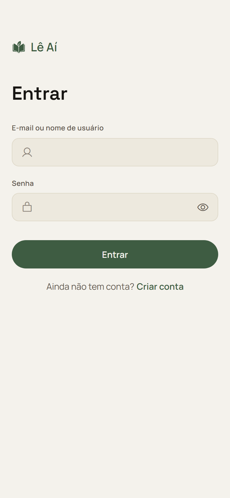
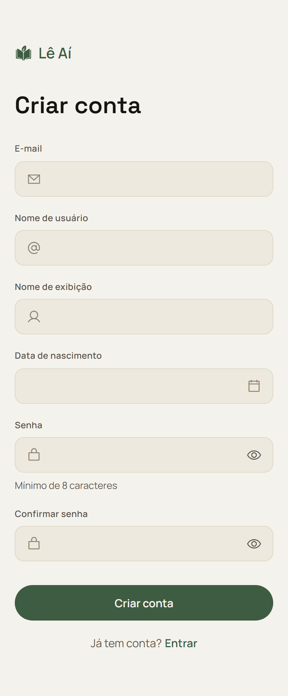
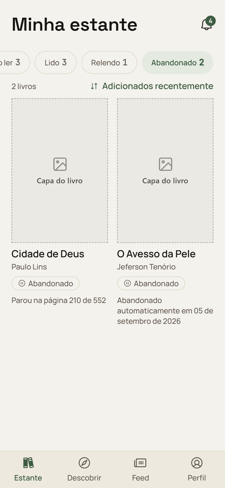
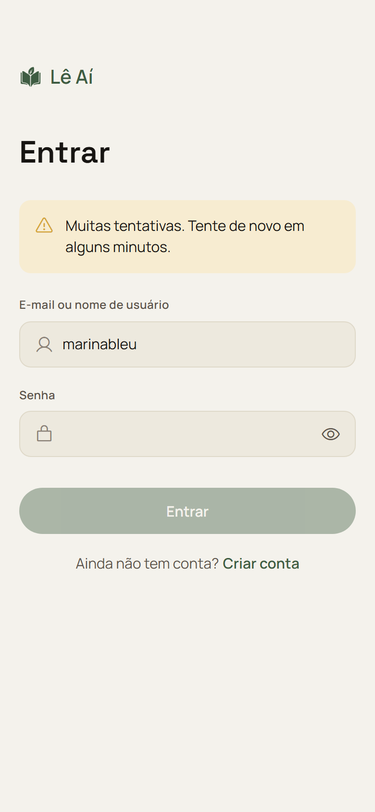
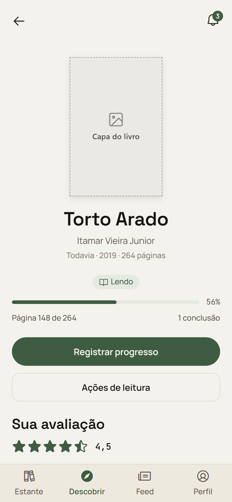
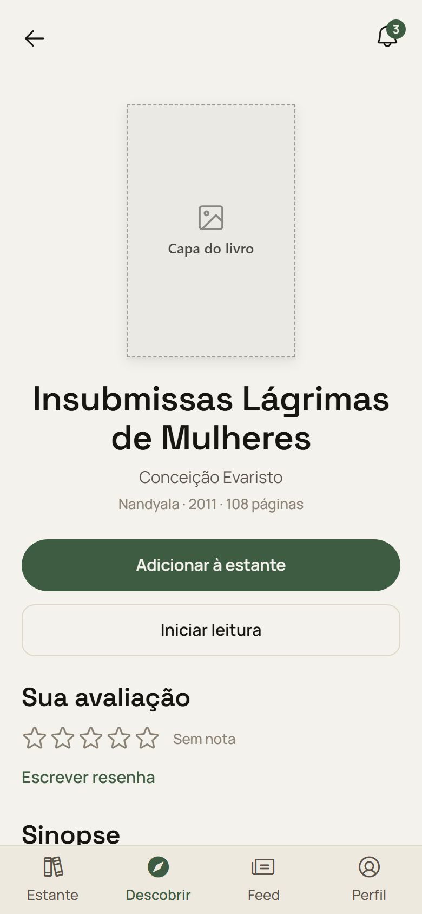
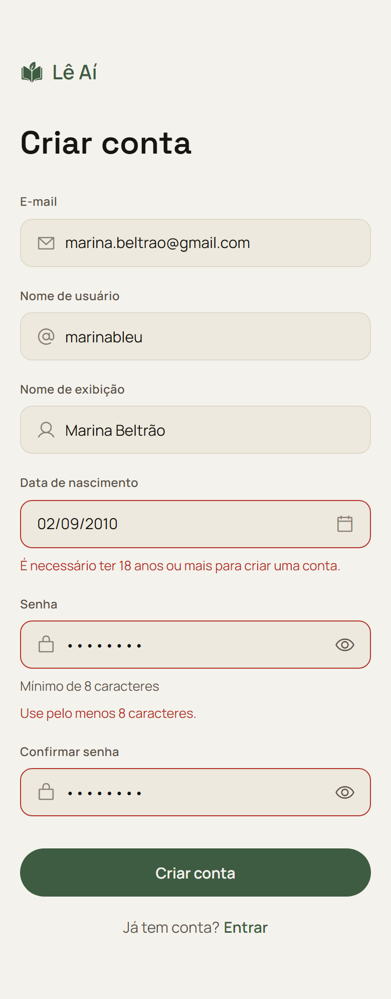

# Avaliação Heurística dos Protótipos do Lê Ai

**Aplicação:** protótipos de alta fidelidade do Lê Ai para o Período 0 e o Período 1, disponíveis em [`docs/design/`](design/)

---

## 1. Introdução

### Objetivo da análise

Avaliar a usabilidade dos protótipos de alta fidelidade do Lê Ai **antes** que as telas do Período 1 sejam implementadas, para que os problemas encontrados sejam corrigidos no protótipo, onde a correção custa uma edição, e não no código já entregue.

O recorte são os onze protótipos versionados no repositório: três do Período 0 (`P0-NAV`) e oito do Período 1 (`F-ACV-BUSCA`, `F-AVA`, `F-EST`, `F-PRG`). Cada arquivo reúne, lado a lado, todos os estados desenhados da tela: padrão, preenchido, erro, carregamento, vazio, modo escuro e os recortes mobile e web.

### Cenário da análise

Marina Torres, a persona do projeto, tem 25 anos e quer voltar a ler com constância. Ela cria uma conta, procura *Torto Arado* no acervo, coloca o livro na estante, começa a leitura, registra o progresso ao longo de duas semanas, dá uma nota e escreve uma resenha. Em algum momento ela erra a senha, perde o fio de um livro que tinha começado e precisa encontrar de novo uma tela que já visitou. Esse é o percurso avaliado, correspondente ao caminho crítico do produto que os onze protótipos cobrem.

### Metodologia do estudo

Os protótipos são bundles HTML auto-extraíveis, que só montam a interface depois de executar. A avaliação foi feita, portanto, em duas etapas:

1. **Renderização.** Cada um dos onze arquivos foi aberto em navegador Chromium em modo headless, e cada artboard foi capturado individualmente em imagem, na resolução do viewport que ele declara (390 x 844 para mobile, 1440 x 900 para web, 768 x 900 para o ponto de virada).
2. **Inspeção.** Os problemas foram levantados sobre as imagens renderizadas e conferidos contra o prompt de design correspondente (`docs/design/**/*.md`), que declara o comportamento esperado, e contra o código já implementado em `code/front/`, quando pertinente.

**Nenhum problema entrou nesta lista sem estar visível em uma captura de tela anexada.** A primeira rodada desta avaliação foi feita apenas sobre o texto extraído do HTML e produziu quatro falsos positivos, pois ícones, tooltips, affordances e microcópia dentro de cards não aparecem em extração textual. Todos foram descartados na etapa de renderização, e a seção 4.d registra quais eram, para que ninguém volte a levantá-los.

Os cinco integrantes constam como avaliadores. A marcação em cada problema indica **concordância consolidada**: os seis achados foram revisados e ratificados pelo grupo em conjunto, e não a atribuição de quem observou cada um isoladamente.

### Heurísticas

Foram utilizadas na avaliação as dez heurísticas de usabilidade de Nielsen [1]:

1. Visibilidade do estado do sistema
2. Correspondência entre o sistema e o mundo real
3. Controle e liberdade do usuário
4. Consistência e padrões
5. Prevenção de erros
6. Reconhecimento em vez de memorização
7. Flexibilidade e eficiência de uso
8. Estética e design minimalista
9. Ajudar os usuários a reconhecer, diagnosticar e recuperar-se de erros
10. Ajuda e documentação

---

## 2. Avaliadores

1. Ana Luiza de Freitas Rodrigues
2. Henrique Moreira Gomes de Carvalho
3. Kayke Emanoel de Souza Santos
4. Renato Douglas Nascimento Silva de Oliveira
5. Vicenzo Fonseca de Mello Souza

---

## 3. Principais Problemas

| #      | Problema / Título                                                      | Severidade   | Heurísticas Violadas | Acesso Rápido                |
| ------ | ---------------------------------------------------------------------- | ------------ | -------------------- | :--------------------------: |
| **01** | Login não oferece caminho de recuperação de senha                      | Catastrófico | 3, 9                 | [Ver Detalhes](#problema-01) |
| **02** | Cadastro não apresenta termos de uso nem aviso de privacidade          | Grande       | 10                   | [Ver Detalhes](#problema-02) |
| **03** | Livro abandonado pelo sistema não oferece retomada nem mostra a página | Grande       | 3, 6                 | [Ver Detalhes](#problema-03) |
| **04** | Bloqueio progressivo não informa quanto tempo falta                    | Pequeno      | 1                    | [Ver Detalhes](#problema-04) |
| **05** | Sinopse pendente não tem desfecho de falha desenhado                   | Pequeno      | 1, 9                 | [Ver Detalhes](#problema-05) |
| **06** | Campo de senha não prepara a mensagem de senha comum                   | Pequeno      | 5, 9                 | [Ver Detalhes](#problema-06) |

---

### Problema 01

| Campo                        | Detalhes |
| ---------------------------- | -------- |
| **Número do Problema**       | 1 |
| **Avaliadores**              | **1:** [ X ] &nbsp;&nbsp; **2:** [ X ] &nbsp;&nbsp; **3:** [ X ] &nbsp;&nbsp; **4:** [ X ] &nbsp;&nbsp; **5:** [ X ] |
| **Atividade**                | Entrar na conta depois de esquecer a senha |
| **Problema**                 | A tela de login não tem nenhum link de recuperação de senha, em nenhum dos seis estados desenhados. Quem esquece a senha fica sem saída dentro do produto: as únicas ações oferecidas são tentar de novo e criar outra conta. Criar uma segunda conta é o que o usuário vai fazer na prática, e isso custa a ele a estante, o histórico de progresso e as resenhas já escritas, exatamente os dados que o produto existe para acumular. |
| **Heurística(s) violada(s)** | 3. Controle e liberdade do usuário 9. Ajudar os usuários a reconhecer, diagnosticar e recuperar-se de erros |
| **Severidade**               | [X] Catastrófico &nbsp;&nbsp; [ ] Grande &nbsp;&nbsp; [ ] Pequeno &nbsp;&nbsp; [ ] Cosmético |
| **Local**                    | Tela de login, mobile e web |
| **Solução**                  | Incluir "Esqueci minha senha" abaixo do campo de senha, mesmo que o fluxo completo só chegue em `F-AUT`. Enquanto o envio de e-mail não existir, o link pode levar a uma tela que explique o que fazer. O importante é que o beco sem saída não exista na tela. |

#### Evidência(s)

No `login.html`, artboard `Login · Padrão`, 390 x 844, abaixo do botão `Entrar` existe apenas `Ainda não tem conta? Criar conta`. O mesmo vale para os outros cinco artboards da tela.

O arquivo [`feature-P0-NAV.md`](plano-de-desenvolvimento/periodo-0/feature-P0-NAV.md) confirma a lacuna ao registrar, na lista de pendências, que "recuperação de senha" fica de fora para `F-AUT` retomar.

[⬆ Voltar ao Sumário](#3-principais-problemas)

---

### Problema 02

| Campo                        | Detalhes |
| ---------------------------- | -------- |
| **Número do Problema**       | 2 |
| **Avaliadores**              | **1:** [ X ] &nbsp;&nbsp; **2:** [ X ] &nbsp;&nbsp; **3:** [ X ] &nbsp;&nbsp; **4:** [ X ] &nbsp;&nbsp; **5:** [ X ] |
| **Atividade**                | Criar conta |
| **Problema**                 | O cadastro coleta e-mail, nome de exibição e data de nascimento sem apresentar em nenhum momento termos de uso ou aviso de privacidade. O produto declara tratamento de dados pessoais conforme a LGPD e permite o cadastro apenas para pessoas com 18 anos ou mais. É exatamente a data de nascimento, coletada aqui, que sustenta essa restrição. O usuário entrega os dados sem que a tela diga o que será feito com eles, e o grupo fica sem o registro de consentimento que a própria regra do projeto pressupõe. |
| **Heurística(s) violada(s)** | 10. Ajuda e documentação |
| **Severidade**               | [ ] Catastrófico &nbsp;&nbsp; [X] Grande &nbsp;&nbsp; [ ] Pequeno &nbsp;&nbsp; [ ] Cosmético |
| **Local**                    | Cadastro, abaixo do botão `Criar conta` |
| **Solução**                  | Acrescentar uma linha abaixo do botão, com os dois links, no padrão consagrado: "Ao criar a conta, você concorda com os Termos de uso e com o Aviso de privacidade". Ocupa uma linha, não acrescenta passo ao fluxo e resolve tanto a orientação ao usuário quanto o registro de consentimento. |

#### Evidência(s)

No `cadastro.html`, artboard `Cadastro · Padrão`, 390 x 844, o formulário inteiro é visível na captura, e abaixo do botão `Criar conta` há apenas `Já tem conta? Entrar`. Não há menção a termos, privacidade ou LGPD em nenhum dos sete artboards da tela.

A exigência está registrada na [ata de abertura do projeto](../assets/atas/ATA-2026-08-23.md), no item de requisitos de qualidade: "senhas armazenadas apenas como hash, autenticação por token e tratamento de dados pessoais conforme a LGPD".

[⬆ Voltar ao Sumário](#3-principais-problemas)

---

### Problema 03

| Campo                        | Detalhes |
| ---------------------------- | -------- |
| **Número do Problema**       | 3 |
| **Avaliadores**              | **1:** [ X ] &nbsp;&nbsp; **2:** [ X ] &nbsp;&nbsp; **3:** [ X ] &nbsp;&nbsp; **4:** [ X ] &nbsp;&nbsp; **5:** [ X ] |
| **Atividade**                | Retomar um livro que o sistema abandonou por inatividade |
| **Problema**                 | Quando o sistema abandona uma leitura sozinho, o card avisa corretamente o que aconteceu com a mensagem "Abandonado automaticamente em 05 de setembro de 2026", mas **troca essa informação pela página em que a leitura parou**. O livro abandonado pelo próprio usuário mostra `Parou na página 210 de 552`; o abandonado pelo sistema não mostra página nenhuma. O resultado é que justamente a leitura interrompida sem a vontade do usuário é a que perde o dado necessário para retomá-la. Some-se a isso que nenhum dos dois cards oferece ação de retomada: para voltar ao livro, o usuário precisa abrir a página do livro e trocar o status manualmente. |
| **Heurística(s) violada(s)** | 3. Controle e liberdade do usuário 6. Reconhecimento em vez de memorização |
| **Severidade**               | [ ] Catastrófico &nbsp;&nbsp; [X] Grande &nbsp;&nbsp; [ ] Pequeno &nbsp;&nbsp; [ ] Cosmético |
| **Local**                    | Estante, filtro `Abandonado` |
| **Solução**                  | Mostrar as duas informações no card do abandono automático, tanto a data quanto a página em que parou, e acrescentar a ação `Retomar leitura` nos cards de livro abandonado. O sistema conhece a página, então retomar é barato e devolve ao usuário o controle sobre uma decisão que não foi dele. |

#### Evidência(s)

No `estante.html`, artboard `Estante · Abandonado automaticamente`, 390 x 844, os dois cards aparecem lado a lado e a diferença é direta:

| Livro | Como foi abandonado | Informação no card |
| --- | --- | --- |
| Cidade de Deus | pelo usuário | `Parou na página 210 de 552` |
| O Avesso da Pele | pelo sistema | `Abandonado automaticamente em 05 de setembro de 2026` |

Nenhum dos dois cards traz ação de retomada.

[⬆ Voltar ao Sumário](#3-principais-problemas)

---

### Problema 04

| Campo                        | Detalhes |
| ---------------------------- | -------- |
| **Número do Problema**       | 4 |
| **Avaliadores**              | **1:** [ X ] &nbsp;&nbsp; **2:** [ X ] &nbsp;&nbsp; **3:** [ X ] &nbsp;&nbsp; **4:** [ X ] &nbsp;&nbsp; **5:** [ X ] |
| **Atividade**                | Tentar entrar depois de errar a senha várias vezes |
| **Problema**                 | A mensagem de bloqueio diz que o acesso foi suspenso, mas não diz por quanto tempo. "Alguns minutos" pode ser um ou quinze, e o usuário não tem como saber se vale esperar na tela ou voltar depois. Como o bloqueio é progressivo e a espera aumenta a cada tentativa, a imprecisão cresce junto: na quarta tentativa "alguns minutos" pode já não descrever a realidade. |
| **Heurística(s) violada(s)** | 1. Visibilidade do estado do sistema |
| **Severidade**               | [ ] Catastrófico &nbsp;&nbsp; [ ] Grande &nbsp;&nbsp; [X] Pequeno &nbsp;&nbsp; [ ] Cosmético |
| **Local**                    | Login, estado de bloqueio |
| **Solução**                  | Informar o tempo restante de forma concreta, com contagem regressiva ou com o minuto em que a nova tentativa será liberada. O backend já controla a janela de bloqueio, então o dado existe para ser mostrado. |

#### Evidência(s)

No `login.html`, artboard `Login · Bloqueio progressivo`, 390 x 844, a mensagem exibida é, na íntegra: `Muitas tentativas. Tente de novo em alguns minutos.`

Vale registrar o que a tela já faz certo, visível na mesma captura: o botão `Entrar` aparece desabilitado durante o bloqueio, o que evita que o usuário aumente a própria punição tentando de novo. O problema é apenas a imprecisão do prazo.

[⬆ Voltar ao Sumário](#3-principais-problemas)

---

### Problema 05

| Campo                        | Detalhes |
| ---------------------------- | -------- |
| **Número do Problema**       | 5 |
| **Avaliadores**              | **1:** [ X ] &nbsp;&nbsp; **2:** [ X ] &nbsp;&nbsp; **3:** [ X ] &nbsp;&nbsp; **4:** [ X ] &nbsp;&nbsp; **5:** [ X ] |
| **Atividade**                | Ler a sinopse de um livro recém-aberto |
| **Problema**                 | A página do livro desenha o estado de sinopse carregando (skeleton) e o estado de sinopse inexistente, mas não desenha o estado de falha. Como a sinopse chega por um fluxo assíncrono que depende de serviço externo, a falha é um desfecho provável. Quando ela ocorrer, o usuário ficará diante de um skeleton que nunca resolve, sem mensagem e sem como pedir de novo. Um carregamento eterno é pior do que um erro: o usuário não sabe se espera ou se desiste. |
| **Heurística(s) violada(s)** | 1. Visibilidade do estado do sistema 9. Ajudar os usuários a reconhecer, diagnosticar e recuperar-se de erros |
| **Severidade**               | [ ] Catastrófico &nbsp;&nbsp; [ ] Grande &nbsp;&nbsp; [X] Pequeno &nbsp;&nbsp; [ ] Cosmético |
| **Local**                    | Página do livro, seção `Sinopse` |
| **Solução**                  | Desenhar um terceiro estado para a seção, com texto curto e ação de nova tentativa, e definir no prompt o tempo máximo de skeleton antes de cair nele. A página já resolve bem o caso análogo no nível da tela inteira, com `Não foi possível carregar os resultados. Verifique sua conexão e tente de novo.` e o botão `Tentar de novo`. O mesmo padrão serve para a seção. |

#### Evidência(s)

No `pagina-do-livro.html`, artboard `Página do livro · Sinopse pendente`, 390 x 844, a captura mostra o acerto do desenho: a página abre inteira e utilizável, com hero, status, progresso e ações completos, pois a sinopse não bloqueia a renderização. A seção `Sinopse`, em skeleton, fica abaixo do recorte visível.

No `pagina-do-livro.html`, artboard `Página do livro · Sinopse ausente`, o caso conhecido está bem resolvido com a frase `Este livro ainda não tem sinopse no acervo.`

O que não existe é o terceiro caso. O prompt [`pagina-do-livro.md`](design/periodo-1/F-ACV-BUSCA/pagina-do-livro.md) §4.3 descreve o skeleton com a frase "Só a seção de sinopse está em skeleton", enquanto o §5.3 descreve a ausência sem prever desfecho de erro. O inventário de artboards da tela confirma: há `Sinopse pendente` e `Sinopse ausente`, mas nenhum estado de falha.

[⬆ Voltar ao Sumário](#3-principais-problemas)

---

### Problema 06

| Campo                        | Detalhes |
| ---------------------------- | -------- |
| **Número do Problema**       | 6 |
| **Avaliadores**              | **1:** [ X ] &nbsp;&nbsp; **2:** [ X ] &nbsp;&nbsp; **3:** [ X ] &nbsp;&nbsp; **4:** [ X ] &nbsp;&nbsp; **5:** [ X ] |
| **Atividade**                | Escolher uma senha no cadastro |
| **Problema**                 | O único critério comunicado é o mínimo de oito caracteres. O requisito de segurança do projeto pede também verificação contra lista de senhas comuns, mas nenhum protótipo desenhou a mensagem correspondente. Desse modo, quando a regra entrar no backend, a tela vai recusar a senha sem ter texto preparado para explicar o motivo. O usuário que digitar `12345678` cumpre o critério que a tela informa e ainda assim será recusado, sem entender por quê. |
| **Heurística(s) violada(s)** | 5. Prevenção de erros 9. Ajudar os usuários a reconhecer, diagnosticar e recuperar-se de erros |
| **Severidade**               | [ ] Catastrófico &nbsp;&nbsp; [ ] Grande &nbsp;&nbsp; [X] Pequeno &nbsp;&nbsp; [ ] Cosmético |
| **Local**                    | Cadastro, campo `Senha` |
| **Solução**                  | Escrever a mensagem de senha comum no prompt de design e desenhá-la no artboard de erro de validação. O helper atual continua válido; o que falta é cobrir o segundo critério, que hoje existe na regra mas não na tela. |

#### Evidência(s)

No `cadastro.html`, artboard `Cadastro · Erro de validação`, 390 x 844, as duas únicas mensagens de erro de campo desenhadas são as visíveis na captura; o helper permanente do campo de senha é `Mínimo de 8 caracteres`.

O arquivo [`feature-P0-NAV.md`](plano-de-desenvolvimento/periodo-0/feature-P0-NAV.md) registra a lacuna de forma explícita nas pendências: o requisito "pede verificação contra lista de senhas comuns, além do mínimo de 8 caracteres. Implementado só o mínimo de 8; nenhum dos protótipos desenhou copy para o erro de senha comum."

[⬆ Voltar ao Sumário](#3-principais-problemas)

---

## 4. Resumo dos Resultados

### a. Problemas Identificados por Heurística

| Heurística | Ocorrências | Problemas |
| --- | :---: | --- |
| 9. Reconhecer, diagnosticar e recuperar-se de erros | 3 | 01, 05, 06 |
| 1. Visibilidade do estado do sistema | 2 | 04, 05 |
| 3. Controle e liberdade do usuário | 2 | 01, 03 |
| 5. Prevenção de erros | 1 | 06 |
| 6. Reconhecimento em vez de memorização | 1 | 03 |
| 10. Ajuda e documentação | 1 | 02 |
| 2. Correspondência com o mundo real | 0 | Nenhum |
| 4. Consistência e padrões | 0 | Nenhum |
| 7. Flexibilidade e eficiência de uso | 0 | Nenhum |
| 8. Estética e design minimalista | 0 | Nenhum |

A heurística 9 é a mais violada, e o padrão por trás disso é consistente: os protótipos desenham muito bem o caminho em que tudo dá certo e os erros **previstos**, mas deixam de fora os desfechos em que o usuário precisa sair de uma situação ruim, como uma senha esquecida, uma sinopse que não chega ou uma senha recusada por um critério que a tela não anunciou.

Quatro heurísticas não registraram nenhuma violação. Isso não é falta de rigor da avaliação: a terminologia é consistente e em português corrente em todas as telas, os padrões visuais se repetem sem desvio entre as onze telas, os atalhos e estados de hover estão desenhados, e o design é econômico, sem elementos decorativos disputando atenção com o conteúdo.

### b. Problemas Classificados por Severidade

- **Problema catastrófico (1):** o login sem recuperação de senha (01). Deixa o usuário sem acesso à própria conta, e a saída natural de criar outra conta destrói o histórico que o produto existe para acumular. Exige correção antes de qualquer entrega ao usuário final.
- **Problemas grandes (2):** a ausência de termos e privacidade no cadastro (02) e o abandono automático sem página nem retomada (03). O primeiro expõe o próprio grupo diante de uma exigência que o projeto assumiu; o segundo transforma uma interrupção involuntária em trabalho manual para o usuário.
- **Problemas pequenos (3):** o bloqueio sem prazo (04), a sinopse sem desfecho de falha (05) e a mensagem de senha comum que não existe (06). Todos corrigíveis com poucas linhas de texto de interface e um artboard novo.
- **Problemas cosméticos:** nenhum identificado.

### c. Problemas Prioritários a Serem Resolvidos

A prioridade é curta. O link de recuperação de senha (01) precisa entrar no protótipo antes que a tela de login seja considerada fechada, pois é um link que resolve o único beco sem saída do produto.

Em seguida vêm os dois problemas ligados a compromissos que o projeto já assumiu e ainda não cumpriu na interface: os termos de uso e o aviso de privacidade no cadastro (02), ligados à LGPD, e a mensagem de senha comum (06), ligada ao requisito de segurança. Os dois já constam como pendência em outros documentos do repositório; falta trazê-los para a tela.

Por fim, há um padrão que vale corrigir de uma vez em vez de caso a caso: **todo estado assíncrono precisa de um desfecho de falha desenhado**. O problema 05 é a instância encontrada, mas a regra é geral e barata de adotar agora, enquanto o Período 1 ainda não foi implementado.

### d. Hipóteses descartadas na renderização

Registradas para que não voltem a ser levantadas. As quatro foram suspeitas levantadas na leitura do código-fonte dos protótipos e **refutadas** quando as telas foram renderizadas e vistas:

| Suspeita | O que a tela renderizada mostra |
| --- | --- |
| A navegação desapareceria por completo no ponto de virada (768 px) | A sidebar está presente, no modo retraído, com os quatro ícones e o item ativo destacado. |
| A sidebar retraída não teria como revelar o nome de cada ícone | O tooltip existe: no artboard `Item em hover`, o rótulo `Feed` aparece ao lado do ícone correspondente. |
| O abandono automático não avisaria o usuário do que aconteceu | O card traz a microcópia `Abandonado automaticamente em 05 de setembro de 2026`. O que de fato falta é a página e a retomada, conforme descrito no problema 03, de escopo bem menor. |
| A data de nascimento seria um campo de texto livre sem seletor | O campo exibe ícone de calendário, indicando seletor de data. |

A lição de método fica registrada junto: **em protótipo, texto extraído não substitui a tela renderizada.** Ícone, tooltip, affordance e microcópia dentro de card não aparecem em extração textual, e são justamente onde mora boa parte da usabilidade.

---

## 5. Conclusão

Os protótipos do Lê Ai são de qualidade alta e bem acima do que se costuma ver nesta etapa. Estados vazios, de carregamento e de erro estão desenhados tela a tela; as ações destrutivas têm confirmação que explica a consequência em vez de apenas perguntar "tem certeza?"; a distinção entre nota zero e ausência de nota, que costuma passar despercebida, foi resolvida explicitamente; o cold start do servidor gratuito é tratado como carregamento e não como falha; e existe até estado de envio enfileirado para uso offline. As mensagens de erro são específicas e acionáveis. Por exemplo, `Você já está na página 148. Informe uma página maior.` diz exatamente o que fazer.

A própria avaliação é testemunha disso: das dez suspeitas levantadas na primeira leitura, quatro caíram assim que as telas foram vistas de verdade, porque o desenho já tinha resolvido o problema de um jeito que a leitura do código não revelava. Sobraram seis, e apenas um deles é catastrófico.

O que falta não é acabamento, mas a cobertura dos desfechos em que o usuário precisa se recuperar de alguma coisa. Esquecer a senha, ter um livro abandonado pelo sistema e esperar uma sinopse que não vem são percursos que não foram desenhados até o fim. Esses são justamente os momentos em que uma interface decide se mantém ou perde o usuário.

A recomendação é tratar o problema catastrófico e os dois ligados a compromissos já assumidos (LGPD e senha comum) antes de implementar as telas do Período 1, e adotar como regra de design, daqui em diante, que todo estado assíncrono tenha desfecho de falha desenhado. São correções de protótipo, não de código, o que torna esta avaliação barata agora e cara depois.

---

## Referências

**[1]** NIELSEN, Jakob. *10 Usability Heuristics for User Interface Design*. Nielsen Norman Group, 1994. Disponível em: [https://www.nngroup.com/articles/ten-usability-heuristics/](https://www.nngroup.com/articles/ten-usability-heuristics/). Acesso em: 15 set. 2026.
